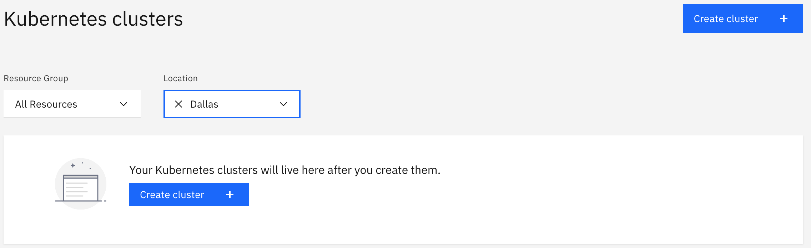
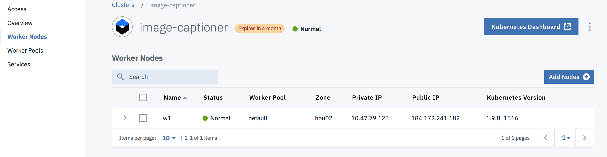
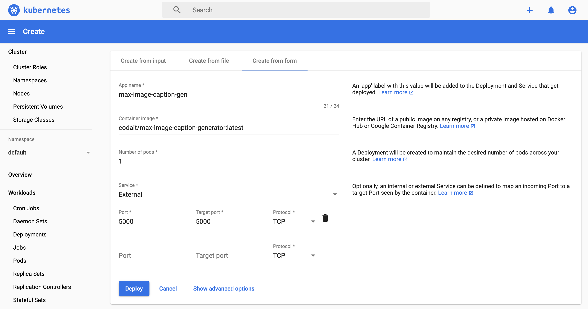
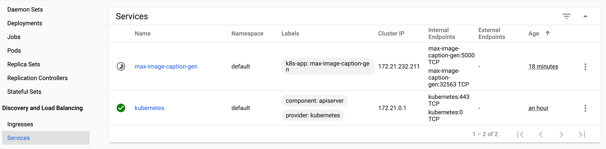
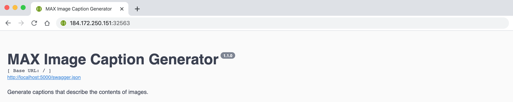

# Deploying the Image Caption Generator model to IBM Cloud

1. Create a cluster using the [IBM Cloud Container Service](https://cloud.ibm.com/containers-kubernetes/clusters
). For this Code Pattern we will only need to use the Free tier which gives us access to a Kubernetes cluster with 1 worker node.
   > Note: This could take anywhere from 10 minutes to half an hour.

   

2. (Optional Step) The instructions to install the command line tools are optional and not required to deploy the model using this tutorial. While not required, you may choose to install them while waiting for the cluster to be created.

3. On your cluster dashboard, select `Worker Nodes` in the sidebar and take note of the `Public IP Address` for the node.

   > Note: The IP address will not be displayed until the cluster is fully deployed.
   
   

4. Click the `Kubernetes Dashboard` button to open the dashboard. Hit the `+ Create` button in the top right corner. Go to `Create from form`.
   Fill in the following fields:
   ```
    App name: <Select a name>
    Container image: codait/max-image-caption-generator:latest
    Number of pods: 1
    Service: External
    Port: 5000 | Target Port: 5000 | Protocol: TCP
   ```
   Then click `Deploy`

   

5. In the sidebar, scroll down to `Services` under `Discovery and Load Balancing`. Click on the service that was created in the previous step. Under the `Internal endpoints`, make note of the port number that is within the range `30000` to `32676`. This port is the `NodePort`.

   

6. The MAX model should be accessible at `<Public IP>:<NodePort>`.

   
