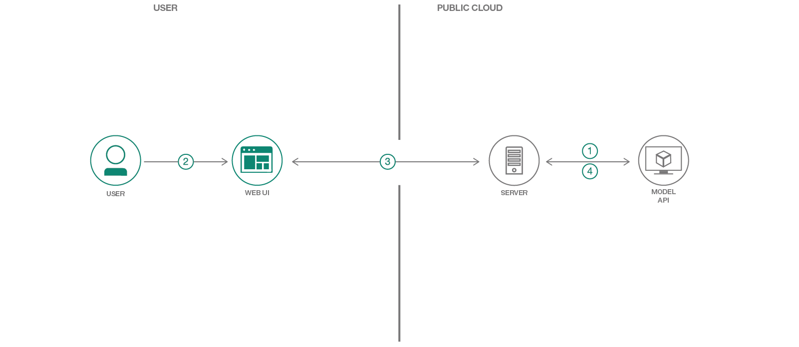

[](https://travis-ci.org/IBM/MAX-Image-Caption-Generator-Web-App)

# Create a web app to interact with machine learning generated image captions

Every day 2.5 quintillion bytes of data are created, based on an
[IBM study](https://public.dhe.ibm.com/common/ssi/ecm/wr/en/wrl12345usen/watson-customer-engagement-watson-marketing-wr-other-papers-and-reports-wrl12345usen-20170719.pdf).
A lot of that data is unstructured data, such as large texts, audio recordings, and images. In order to do something
useful with the data, we must first convert it to structured data.

In this Code Pattern we will use one of the models from the
[Model Asset Exchange (MAX)](https://developer.ibm.com/code/exchanges/models/),
an exchange where developers can find and experiment with open source deep learning
models. Specifically we will be using the [Image Caption Generator](https://github.com/IBM/MAX-Image-Caption-Generator)
to create a web application that will caption images and allow the user to filter through
images based image content. The web application provides an interactive user interface
backed by a lightweight python server using Tornado. The server takes in images via the
UI and sends them to a REST end point for the model and displays the generated
captions on the UI. The model's REST endpoint is set up using the docker image
provided on MAX. The Web UI displays the generated captions for each image as well
as an interactive word cloud to filter images based on their caption.

When the reader has completed this Code Pattern, they will understand how to:

* Build a Docker image of the Image Caption Generator MAX Model
* Deploy a deep learning model with a REST endpoint
* Generate captions for an image using the MAX Model's REST API
* Run a web application that using the model's REST API



## Flow

1. Server sends default images to Model API and receives caption data.
2. User interacts with Web UI containing default content and uploads image(s).
3. Web UI requests caption data for image(s) from Server and updates content when data is returned.
4. Server sends image(s) to Model API and receives caption data to return to Web UI.

## Included Components

* [IBM Model Asset Exchange](https://developer.ibm.com/code/exchanges/models/): A place for developers to find and use
free and open source deep learning models.
* [Docker](https://www.docker.com): Docker is a tool designed to make it easier to create, deploy, and run applications
by using containers.

## Featured Technologies

* [Python](https://www.python.org/): Python is a programming language that lets you work more quickly and integrate
your systems more effectively.
* [JQuery](https://jquery.com): jQuery is a cross-platform JavaScript library designed to simplify the client-side
scripting of HTML.
* [Bootstrap 3](https://getbootstrap.com): Bootstrap is a free and open-source front-end library for designing websites
and web applications.
* [Pexels](https://www.pexels.com): Pexels provides high quality and completely free stock photos licensed under the
Creative Commons Zero (CC0) license.

# Watch the Video

The following is a talk at Spark+AI Summit 2018 about MAX that includes a short demo of the web app.

[](https://vimeo.com/274936527)

# Steps

Ways to run the code pattern:

- [Deploy to IBM Cloud](#deploy-to-ibm-cloud)
- [Deploy on Kubernetes](#deploy-on-kubernetes)
- [Run Locally](#run-locally)

## Deploy to IBM Cloud

### Deploy the Model

Follow the [Deploy the Model Doc](DEPLOY_MODEL.md) to deploy the Image Caption Generator model to IBM Cloud.
If you already have a model API endpoint available you can skip this process.

> Note: Deploying the model can take time, to get going faster you can try [running locally](#run-locally).

### Deploy the Web App

1. Press the `Deploy to IBM Cloud` button. If you do not have an IBM Cloud account yet, you will need to create one.

    [](https://bluemix.net/deploy?repository=https://github.com/IBM/MAX-Image-Caption-Generator-Web-App)

2. Click `Delivery Pipeline` and fill in the form with the Image Caption Generator API endpoint deployed above, then click on `Create`.

    > The format for this entry should be `http://170.0.0.1:5000`

    

3. In Toolchains, click on `Delivery Pipeline` to watch while the app is deployed. Once deployed, the app can be
viewed by clicking `View app`.

    

## Deploy on Kubernetes

You can also deploy the model and web app on Kubernetes using the latest docker images on Docker Hub.

On your Kubernetes cluster, run the following commands:

    kubectl apply -f https://raw.githubusercontent.com/IBM/MAX-Image-Caption-Generator/master/max-image-caption-generator.yaml
    kubectl apply -f https://raw.githubusercontent.com/IBM/MAX-Image-Caption-Generator-Web-App/master/max-image-caption-generator-web-app.yaml

The web app will be available at port `8088` of your cluster and the model API at port `5000`.

## Run Locally

> NOTE: These steps are only needed when running locally instead of using the `Deploy to IBM Cloud` button.

#### Setting up the MAX Model

1. [Deploy the Model](#1-deploy-the-model)
2. [Experimenting with the API (Optional)](#2-experimenting-with-the-api-optional)

#### Starting the Web App

1. [Check out the code](#1-check-out-the-code)
2. [Installing dependencies](#2-installing-dependencies)
3. [Running the server](#3-running-the-server)
4. [Configuring ports (Optional)](#4-configuring-ports-optional)
5. [Instructions for Docker (Optional)](#5-instructions-for-docker-optional)

### Setting up the MAX Model

> NOTE: The set of instructions in this section are a modified version of the one found on the
[Image Caption Generator Project Page](https://github.com/IBM/MAX-Image-Caption-Generator)

#### 1. Deploy the Model

To run the docker image, which automatically starts the model serving API, run:

    docker run -it -p 5000:5000 codait/max-image-caption-generator

This will pull a pre-built image from Docker Hub (or use an existing image if already cached locally) and run it.
If you'd rather build the model locally you can follow the steps in the
[model README](https://github.com/IBM/MAX-Image-Caption-Generator/blob/master/README.md#steps).

_Note_ that currently this docker image is CPU only (we will add support for GPU images later).

#### 2. Experimenting with the API (Optional)

The API server automatically generates an interactive Swagger documentation page.
Go to `http://localhost:5000` to load it. From there you can explore the API and also create test requests.

Use the `model/predict` endpoint to load a test file and get captions for the image from the API.

The [model assets folder](https://github.com/IBM/MAX-Image-Caption-Generator/tree/master/assets)
contains a few images you can use to test out the API, or you can use your own.

You can also test it on the command line, for example:

    curl -F "image=@path/to/image.jpg" -X POST http://localhost:5000/model/predict

```json
{
  "status": "ok",
  "predictions": [
    {
      "index": "0",
      "caption": "a man riding a wave on top of a surfboard .",
      "probability": 0.038827644239537
    },
    {
      "index": "1",
      "caption": "a person riding a surf board on a wave",
      "probability": 0.017933410519265
    },
    {
      "index": "2",
      "caption": "a man riding a wave on a surfboard in the ocean .",
      "probability": 0.0056628732021868
    }
  ]
}
```

### Starting the Web App

#### 1. Check out the code

Clone the Image Caption Generator Web App repository locally by running the following command:

    git clone https://github.com/IBM/MAX-Image-Caption-Generator-Web-App.git

> Note: You may need to `cd ..` out of the MAX-Image-Caption-Generator directory first

Then change directory into the local repository

    cd MAX-Image-Caption-Generator-Web-App

#### 2. Installing dependencies

Before running this web app you must install its dependencies:

    pip install -r requirements.txt

#### 3. Running the server

You then start the web app by running:

    python app.py

Once it's finished processing the default images (< 1 minute) you can then access the web app at:
[`http://localhost:8088`](http://localhost:8088)

The Image Caption Generator endpoint must be available at `http://localhost:5000` for the web app to successfully start.

#### 4. Configuring ports (Optional)

If you want to use a different port or are running the ML endpoint at a different location
you can change them with command-line options:

    python app.py --port=[new port] --ml-endpoint=[endpoint url including protocol and port]

#### 5. Instructions for Docker (Optional)

To run the web app with Docker the containers running the web server and the REST endpoint need to share the same
network stack. This is done in the following steps:

Modify the command that runs the Image Caption Generator REST endpoint to map an additional port in the container to a
port on the host machine. In the example below it is mapped to port `8088` on the host but other ports can also be used.

    docker run -it -p 5000:5000 -p 8088:8088 --name max-image-caption-generator codait/max-image-caption-generator

Build the web app image by running:

    docker build -t max-image-caption-generator-web-app .

Run the web app container using:

    docker run --net='container:max-image-caption-generator' -it max-image-caption-generator-web-app

##### Using the Docker Hub Image

You can also deploy the web app with the latest docker image available on DockerHub by running:

    docker run --net='container:max-image-caption-generator' -it codait/max-image-caption-generator-web-app

This will use the model docker container run above and can be run without cloning the web app repo locally.

# Sample Output


# Troubleshooting

There is a large amount of user uploaded images in a long running web app

> When running the web app at `http://localhost:8088` an admin page is available at
> [`http://localhost:8088/cleanup`](http://localhost:8088/cleanup) that allows the user to delete all user uploaded
> files from the server.
>
> [Note: This deletes **all** user uploaded images]


# Links

* [Model Asset eXchange (MAX)](https://developer.ibm.com/code/exchanges/models/)
* [Center for Open-Source Data & AI Technologies (CODAIT)](https://developer.ibm.com/code/open/centers/codait/)
* [MAX Announcement Blog](https://developer.ibm.com/code/2018/03/20/igniting-a-community-around-deep-learning-models-with-model-asset-exchange-max/)

## Libraries used in this Code Pattern
* [D3.js](https://d3js.org): D3.js is a JavaScript library for manipulating documents based on data.
* [d3-cloud](https://github.com/jasondavies/d3-cloud): A Wordle-inspired word cloud layout written in JavaScript.
* [Featherlight](https://noelboss.github.io/featherlight/): Featherlight is a very lightweight jQuery lightbox plugin.
* [Glyphicons](http://glyphicons.com): GLYPHICONS is a library of precisely prepared monochromatic icons and symbols,
created with an emphasis to simplicity and easy orientation.
* [Image Picker](http://rvera.github.io/image-picker/): Image Picker is a simple jQuery plugin that transforms a select
element into a more user friendly graphical interface.

# Learn More

* **Artificial Intelligence Code Patterns**: Enjoyed this Code Pattern? Check out our other
[Artificial Intelligence Code Patterns](https://developer.ibm.com/code/technologies/artificial-intelligence/)
* **AI and Data Code Pattern Playlist**: Bookmark our
[playlist](https://www.youtube.com/playlist?list=PLzUbsvIyrNfknNewObx5N7uGZ5FKH0Fde) with all of our Code Pattern videos
* **Watson Studio**: Master the art of data science with IBM's [Watson Studio](https://dataplatform.ibm.com/)
* **Deep Learning with Watson Studio**: Design and deploy deep learning models using neural networks, easily scale to
hundreds of training runs. Learn more at [Deep Learning with Watson Studio](https://www.ibm.com/cloud/deep-learning).

# License
[Apache 2.0](LICENSE)
